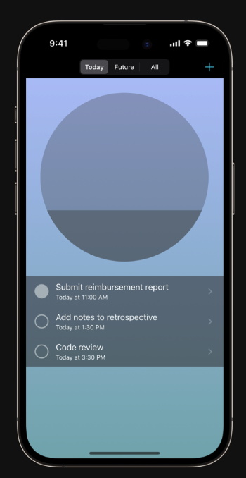
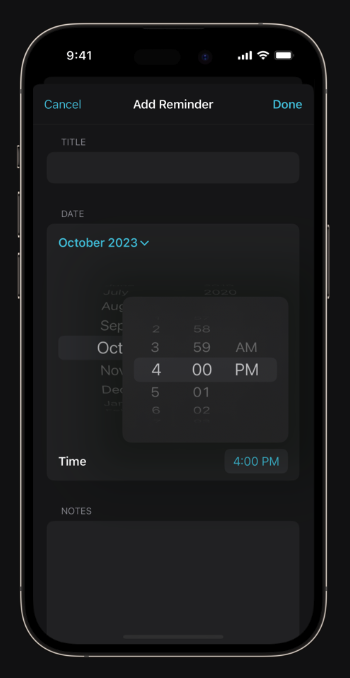

## Today

Today is a productivity app for iOS designed to help users focus on their daily tasks with a calm and visually appealing interface. The application leverages minimalistic design and smooth animations to create a soothing user experience, making task management a pleasant and efficient process.

### Features

- **Reminder List**: The main screen displays a list of reminders categorized by due dates.
  - **Segmented Control**: Filter reminders by "Today", "Future", or "All".
  - **Completion Tracking**: Tap the done button to mark reminders as complete.
  - **Progress Circle**: Visual representation of task completion with a filling circle.
  - **Add Reminder**: Create new reminders using the add button (+).

- **Reminder View and Editing Modes**:
  - **Detail View**: Displays detailed information about a reminder including title, due date, time, and additional notes.
  - **Edit Mode**: Editable fields and pickers allow users to modify reminder details.

- **Add Reminder Screen**: Create new reminders with a modal view presenting input fields similar to the edit mode.

### Screenshots

#### Reminder List


#### Add Reminder Screen


#### Reminder Detail View


### Getting Started

Follow these instructions to get a copy of the project up and running on your local machine for development and testing purposes.

#### Prerequisites

- Xcode 12.0 or later
- iOS 14.0 or later

#### Installation

1. **Clone the repository:**
   ```sh
   git clone https://github.com/your-username/Today.git
   ```
2. **Open the project in Xcode:**
   ```sh
   cd Today
   open Today.xcodeproj
   ```
3. **Install dependencies (if any):**
   ```sh
   pod install
   ```
4. **Run the project:**
   Select the target device or simulator and click the run button in Xcode.

### Usage

- **Viewing Reminders**: Launch the app to see the list of reminders categorized by due dates. Use the segmented control to filter reminders.
- **Adding Reminders**: Tap the add button (+) in the navigation bar to open the Add Reminder screen. Fill in the details and tap "Done" to save.
- **Editing Reminders**: Tap on a reminder to view its details. Use the Edit button to modify reminder details.

### Contributing

Contributions are welcome! Please follow these steps to contribute:

1. Fork the repository.
2. Create a new branch (`git checkout -b feature/YourFeature`).
3. Commit your changes (`git commit -m 'Add some feature'`).
4. Push to the branch (`git push origin feature/YourFeature`).
5. Open a pull request.

### License

This project is licensed under the MIT License - see the [LICENSE](LICENSE) file for details.

### Contact

If you have any questions, feel free to open an issue or contact the project maintainer at [email@example.com](mailto:email@example.com).

---

Replace `path/to/screenshot1.png`, `path/to/screenshot2.png`, and `path/to/screenshot3.png` with the actual paths to the screenshots. Additionally, update the repository URL, contact email, and any other placeholders with the relevant information.
